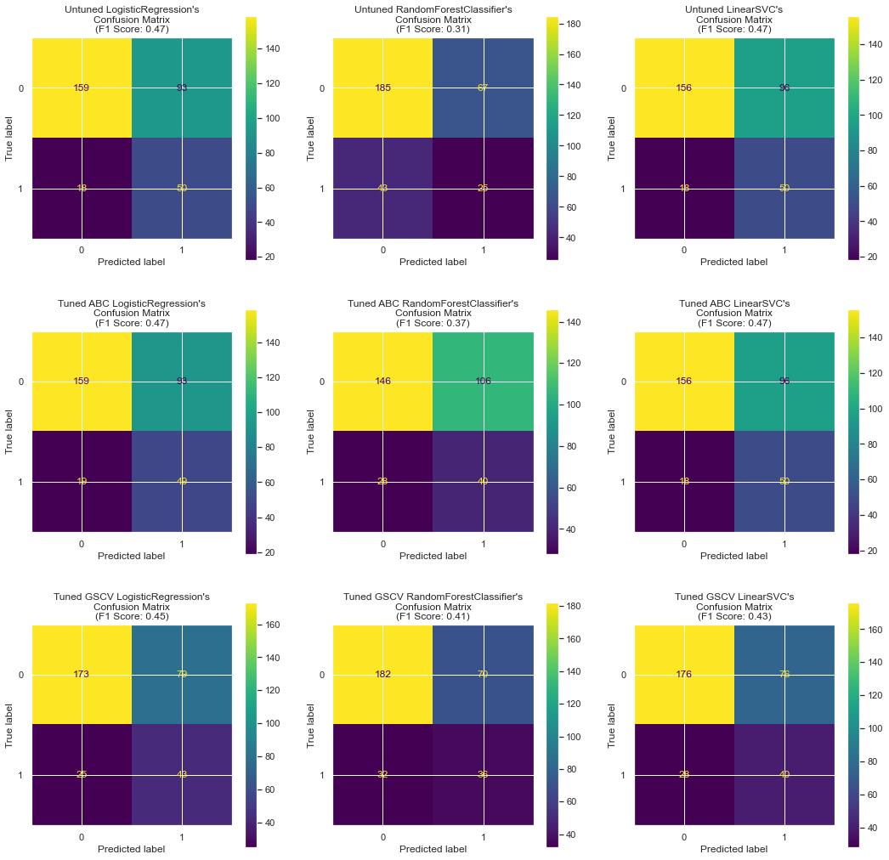
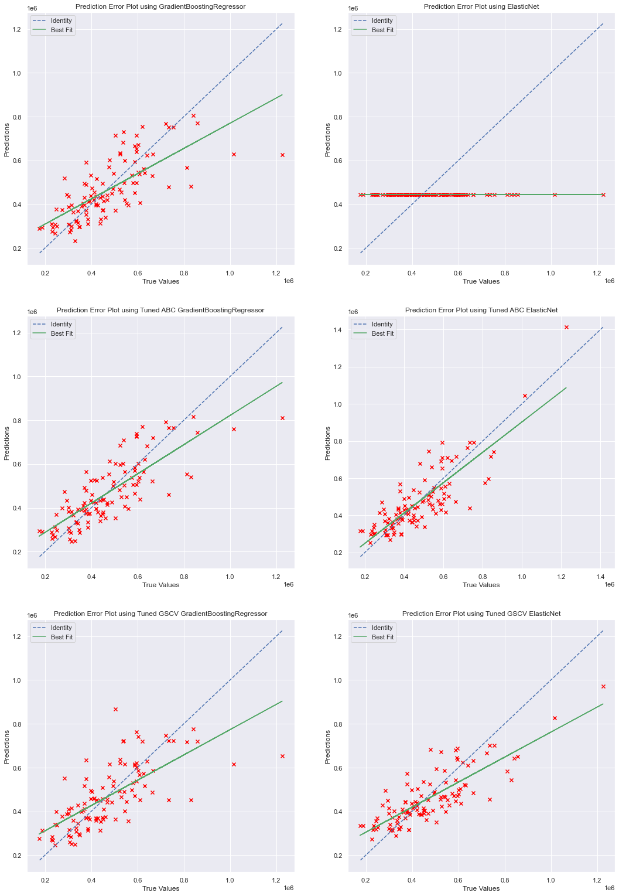

# Machine Learning Project: Regression and Classification with Artificial Bee Colony Algorithm

Welcome to the GitHub repository for my machine learning project, where I've tackled regression and classification tasks using the power of the Artificial Bee Colony (ABC) algorithm for hyperparameter optimization. This project showcases the effectiveness of ABC in optimizing the performance of various machine learning models.

## Project Overview

In this project, I've created Jupyter Notebook files to demonstrate both regression and classification tasks using popular machine learning algorithms. The key highlight of this project is the integration of the Artificial Bee Colony (ABC) algorithm for hyperparameter optimization. ABC is a bio-inspired optimization algorithm that mimics the foraging behavior of bees to find optimal solutions in complex search spaces. It has shown great promise in optimizing machine learning models, and this project explores its potential.

## Key Features

- **Regression Task**: The project includes a Jupyter Notebook file dedicated to regression tasks using the `housing_dataset.csv`. I've utilized popular regression algorithms such as Linear Regression, Decision Trees, Random Forests, and Support Vector Regression. The ABC algorithm is used to fine-tune the hyperparameters of these models, enhancing their predictive performance in estimating housing prices based on factors such as location and size.




- **Classification Task**: Another Jupyter Notebook file focuses on classification tasks using the `credit_dataset.csv`. It involves well-known classification algorithms like Logistic Regression, Random Forest Classifier, and Support Vector Classifier. The ABC algorithm plays a crucial role in optimizing these classifiers for better accuracy in predicting whether a customer will default based on factors such as income and credit history.



## Paper Reference

For a comprehensive understanding of the ABC algorithm and its theoretical foundations, you can refer to the paper titled ["Artificial Bee Colony Algorithm: A Comprehensive Survey and Applications"](https://arxiv.org/pdf/2112.08511.pdf). This paper offers valuable insights into the algorithm's capabilities and its potential in various optimization tasks, including hyperparameter optimization.

## Getting Started

To get started with this project, clone the repository to your local machine:

   ```bash
   git clone https://github.com/glennwuwu/aiml-regression-classification.git
   ```

3. Explore the Jupyter Notebook files to see how regression and classification tasks are performed with the ABC algorithm for hyperparameter optimization.

4. Feel free to adapt and modify the code to suit your specific machine learning projects.

## Datasets

- **Regression Dataset**: The `housing_dataset.csv` is used for regression tasks. It contains factors such as location and size to predict housing prices.

- **Classification Dataset**: The `credit_dataset.csv` is used for classification tasks. It includes factors like income and credit history to predict whether a customer will default.

## License

This project is licensed under the MIT License - see the [LICENSE](LICENSE) file for details.

## Contact

If you have any questions or suggestions regarding this project, feel free to reach out to me. You can find my contact information in my GitHub profile.

Thank you for exploring this machine learning project! I hope you find it valuable and informative. Happy coding! 🐝🧠🤖
